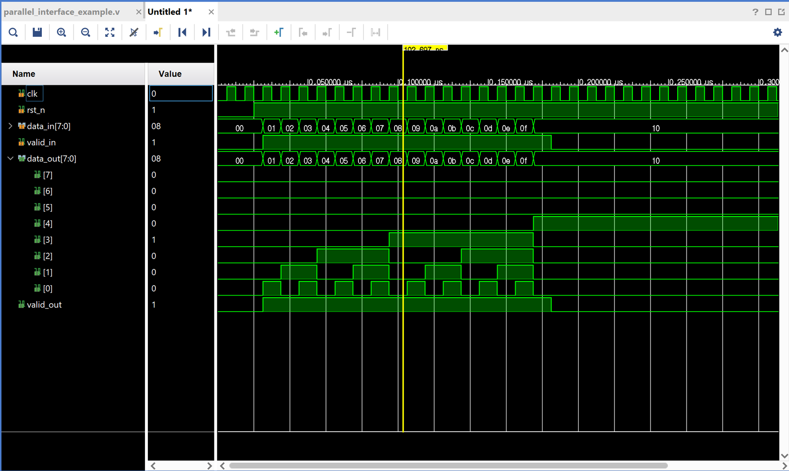

## 1. What Is a Parallel Interface?

A parallel interface transmits multiple bits simultaneously across multiple data lines. As shown below, there are 8 to 32 or more data wires (D[7:0], D[31:0], etc.) between transmitter and receiver, along with a shared clock and control signals such as VALID and READY.

```
┌─────────────┐         ┌─────────────┐
│ Transmitter │  D[7:0] │  Receiver   │
│             ├────────►│             │
│             │  CLK    │             │
│             ├────────►│             │
│             │  VALID  │             │
│             ├────────►│             │
└─────────────┘         └─────────────┘
```

**Advantages:**
- Simple, intuitive structure — easy to design and debug
- High bandwidth at low frequency (e.g., 8-bit × 100 MHz = 800 Mbps)
- No serializer/deserializer needed → low latency
- Shared clock makes synchronization straightforward

---

## 2. Limitations and Real-World Problems

### (1) Pin Count and PCB Complexity

As data width increases, package pin count, PCB routing complexity, and cost grow rapidly.

> Example: A 32-bit parallel bus requires 32 data + 1 clock + 2–4 control = **35–37 pins**

### (2) Skew — The Enemy of Timing

All data bits must arrive simultaneously, but in practice each trace has slightly different lengths, impedances, and loads — causing arrival time differences known as **skew**. At high speeds, skew becomes critical.

```
CLK  ──┐  ┌──┐  ┌──
       └──┘  └──┘
D[0] ───────────────  ← Ideal (no delay)
     ∆t₁↕
D[1] ───────────────  ← Delay from trace length difference
     ∆t₂↕
D[2] ───────────────  ← Additional delay
```

**Real-world impact:**
- At 1 GHz (1 ns period), 200 ps of skew consumes **20% of the timing budget**
- A 1 cm trace length difference ≈ 60–70 ps of skew (propagation speed ~15–17 cm/ns)
- Excessive skew causes setup/hold violations and data errors

**Solutions:**
- Trace length matching (serpentine routing) is mandatory in PCB layout
- Validate skew, reflections, and jitter using SI simulation (IBIS models, etc.)

### (3) EMI and Crosstalk

When multiple signals switch simultaneously, electromagnetic interference (crosstalk) and SSN (Simultaneous Switching Noise) appear between adjacent lines — making FCC/CE EMC certification significantly harder to pass.

### (4) Signal Integrity at High Frequencies

As frequency increases, reflections, ringing, overshoot, and undershoot become critical SI problems.

Power consumption scales with both width and frequency:

$$P = C \times V^2 \times f \times N_{bits}$$

Increasing width worsens pin count, PCB complexity, EMI, and power. Increasing frequency worsens SI, skew, and EMI. Both directions have hard physical limits.

### (5) Board and Cable Design Difficulty

- All traces must be matched to within picoseconds — PCB layout becomes extremely complex
- Longer cables accumulate more skew; connector and cable costs increase accordingly

**Practical design tips:**
- Route data, clock, and control traces on the same layer with matched impedance and serpentine length matching
- For high-speed parallel buses like DDR, use per-byte DQS (source-synchronous strobe) to contain skew to within each byte lane
- Apply Write Leveling and Read Training to compensate for board-specific timing variation

---

## 3. Real-World Examples and the Evolution to Serial

### (1) DDR4 Memory Interface

- 64-bit data + 8-bit ECC = 72 signals total
- Each byte lane has its own DQS strobe signal → skew correction per byte group
- Write Leveling and Read Training automatically compensate for board-level timing variation

### (2) PCI → PCIe Evolution

| Interface | Type | Bus | Frequency | Bandwidth |
|-----------|------|-----|-----------|-----------|
| PCI | Parallel | 32-bit shared | 33 MHz | 133 MB/s |
| PCI-X | Parallel | 64-bit shared | 133 MHz | 1,066 MB/s |
| PCIe Gen1 x16 | Serial | 16 lanes × 1 pair | 2.5 Gbps/lane | ~4 GB/s |
| PCIe Gen5 x16 | Serial | 16 lanes × 1 pair | 32 Gbps/lane | ~64 GB/s |

The industry shifted from parallel shared buses to serial point-to-point links — drastically reducing pin count while multiplying bandwidth by orders of magnitude.

---

## 4. Verilog Example

```verilog
// Simple parallel data transfer example
module parallel_tx (
    input  wire       clk,       // System clock
    input  wire       rst_n,     // Active-low reset
    input  wire [7:0] data_in,   // 8-bit parallel input
    input  wire       valid_in,  // Input valid signal
    output reg  [7:0] data_out,  // 8-bit parallel output
    output reg        valid_out  // Output valid signal
);
    always @(posedge clk or negedge rst_n) begin
        if (!rst_n) begin
            data_out  <= 8'h00;
            valid_out <= 1'b0;
        end else begin
            data_out  <= data_in;   // 1-clock pipeline delay
            valid_out <= valid_in;
        end
    end
endmodule
```

This module registers 8-bit parallel data with a 1-clock pipeline delay — the foundation of synchronous parallel data transfer in FPGA and ASIC design.



**Waveform behavior:** `data_in` is captured on the rising edge of `clk`, and `data_out` appears one clock cycle later. The `valid` signal is delayed identically to maintain handshake timing.

---

## 5. Summary

- Parallel interfaces are intuitive and easy to implement, but face hard physical, electrical, and economic limits at high speeds.
- Skew, EMI, signal integrity, and cost constraints collectively push high-speed designs toward source-synchronous (DQ+DQS) or fully serial (PCIe, USB, etc.) architectures.
- When designing parallel interfaces, always apply trace length matching, SI simulation, and calibration techniques such as Write Leveling and Read Training.
