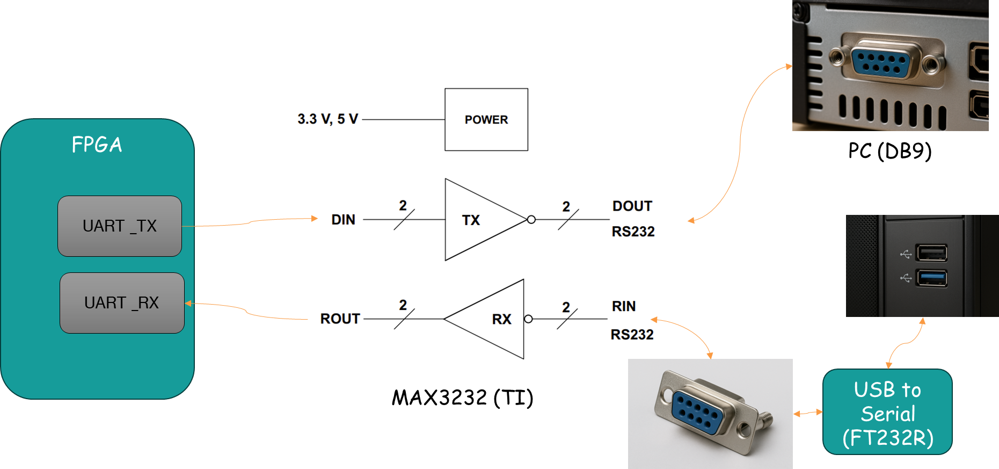
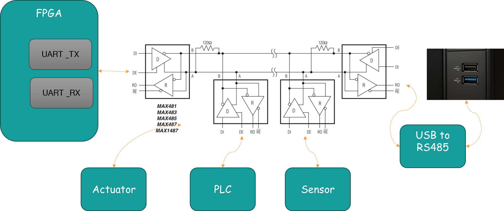

---
title: "RS-232 and RS-485 for UART Systems"
date: 2026-03-16T12:00:00+09:00
draft: false
description: "How UART logic maps to physical layers: RS-232 versus RS-485 wiring, voltage levels, distance, noise tolerance, and deployment trade-offs."
categories:
  - "UART"
tags:
  - "FPGA"
  - "UART"
  - "RTL"
  - "Xilinx"
  - "EasyFPGA"
---
# RS-232 & RS-485

## UART vs RS-232 vs RS-485

> **UART** = Logical protocol (3.3V/0V digital signal)
> **RS-232 / RS-485** = Physical electrical standards (RS = Recommended Standard)

```
┌──────────┐   UART logic    ┌────────────┐  RS-232/485 signal  ┌──────────┐
│   FPGA   ├────────────────►│ Transceiver├────────────────────►│  Device  │
│  (3.3V)  │  TX/RX (CMOS)   │ (MAX3232 / │  (±15V / ±5V diff)  │          │
└──────────┘                 │  RS485)    │                     └──────────┘
                             └────────────┘
```

- FPGA outputs **3.3V CMOS** UART signals
- A **transceiver IC** converts the signal for long-distance transmission

## RS-232 vs RS-485 Comparison

| Item | RS-232 | RS-485 |
|---|---|---|
| **Signal Type** | Single-ended (referenced to GND) | Differential (A and B wires) |
| **Logic Levels** | 1 = −3V to −15V, 0 = +3V to +15V | A−B > +200mV = 0, A−B < −200mV = 1 |
| **Max Distance** | Up to **15 m** | Up to **1,200 m** |
| **Max Speed** | 115.2 kbps typical, ~1 Mbps (short range) | **10 Mbps** (short range) |
| **Multi-drop** | Not supported (1:1 only) | Up to **32 nodes** (1:N) |
| **Duplex** | Full-duplex (TX, RX, GND) | Half-duplex (2-wire A/B) |
| **Connector** | DB-9 (9-pin) | Terminal block, RJ45 |

## RS-232 Details

### Electrical Characteristics

```
Logic '1' (MARK)  : −3V to −15V  ← Negative voltage = logic 1 !
Logic '0' (SPACE) : +3V to +15V  ← Positive voltage = logic 0 !
```

> **Opposite polarity** from TTL/CMOS — a transceiver is always required.

<iframe src="html/rs232_waveform.html" width="100%" height="175" frameborder="0" scrolling="no"></iframe>

### RS-232 Signal on Oscilloscope


<small style="color:#888;font-size:0.7em;">RS-232 UART Oscilloscope Screenshot by Haji Akhundov, licensed under CC BY-SA 3.0</small>

### Representative Transceiver: MAX3232 (TI)



- Operates at 3.3V (internal charge pump generates ±5.5V)
- USB-UART bridge (FT232R, CP2102) can replace RS-232 for PC connection

## RS-485 Details

### Differential Signal Principle

<iframe src="html/rs485_waveform.html" width="100%" height="260" frameborder="0" scrolling="no"></iframe>

- Data is determined by the **voltage difference (A−B)**
- Noise is injected **equally** into both A and B → cancels out in the difference (**CMRR**)

### Wiring Options




- **2-wire**: A, B half-duplex — requires DE/RE direction control
- **4-wire**: TX+/TX−, RX+/RX− full-duplex

## RS-485 Bus Topology

<iframe src="html/rs485_topology.html" width="100%" height="190" frameborder="0" scrolling="no"></iframe>

- **120Ω termination resistors**: prevent signal reflections; placed at both ends
- **Address-based protocols** (e.g., Modbus RTU, DMX512) used with RS-485
- **DE/RE control**: half-duplex requires direction switching

## USB-to-UART Bridge

Modern PCs no longer have RS-232 ports → use a **USB-UART bridge IC**

### Common ICs

| IC | Manufacturer | Notes |
|---|---|---|
| **FT232R** | FTDI | Most widely used, stable drivers |
| **CP2102** | Silicon Labs | Compact, USB bus-powered |
| **CH340G** | WCH | Low-cost, common on Chinese boards |
| **PL2303** | Prolific | Legacy, some compatibility issues |

```
PC USB ──► FT232R ──► UART TX/RX ──► FPGA / MCU
```

## Practical Summary

### RS-232 Connection (FPGA ↔ PC)
```
FPGA 3.3V UART → MAX3232 → DB-9 (RS-232) → PC  (or use USB-UART adapter)
```

### RS-485 Connection (FPGA ↔ Multiple Devices)
```
FPGA UART → RS-485 driver → A/B bus → each node
                            ← 120Ω termination at each end ←
```

### Practical Tips
- RS-232: best for **simple 1:1 debugging** (USB-UART bridge preferred today)
- RS-485: ideal for **factory floors, meters, elevators** and long-distance comms
- Most FPGA boards have a **built-in USB-UART bridge** (FT232, CP2102)

## Episode 3 Summary

- **UART** = logical protocol; **RS-232/485** = physical electrical standard
- **RS-232**: single-ended, ±15V, max 15 m, 1:1 only
- **RS-485**: differential, ±5V, max 1,200 m, up to 32 nodes
- Differential signaling: common-mode noise is cancelled (CMRR)
- Practical choice: USB-UART bridge (FT232, CP2102) for PC connection

### Next Episode
> **Episode 4: UART Implementation Methods on FPGA**
> Vendor IP, Soft Processor, and Custom RTL — which one to choose?

## Key Takeaways

- Build UART logic with timing assumptions made explicit
- Verify behavior with both simulation and hardware-oriented checks
- Keep interfaces minimal and move complexity into reusable RTL blocks

## Code and References

- RTL source repository: https://github.com/Easy-FPGA/easyfpga-uart-core-sv.git
- YouTube: https://www.youtube.com/@easy-fpga


